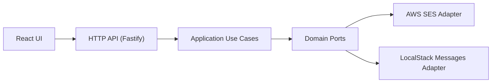

# Architecture

This project uses Clean Architecture with ports and adapters.

```mermaid
flowchart LR
    UI["React UI"] --> API["HTTP API (Fastify)"]
    API --> UC["Application Use Cases"]
    UC --> PORTS["Domain Ports"]
    PORTS --> SES["AWS SES Adapter"]
    PORTS --> LS["LocalStack Messages Adapter"]
```
